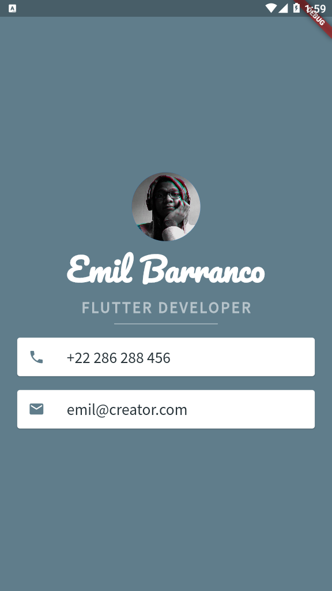

# ~ Flutter Project #2 - MiCard 📝

### ~ Project Preview 🖼️ 

### ~ Project Purposes ℹ️ 

In this second module, we learn how to build UIs with widgets like Row() & Column(), how to keep UI elements on certain areas that the user will be able to see for sure such as SafeArea(), and finally to manipulate the widget's position with the mainAxisAlignment & crossAxisAlignment. Also the following widgets were used for layout & styling:

  - Card()
  - ListTile()
  - SizedBox()
  - CircleAvatar()